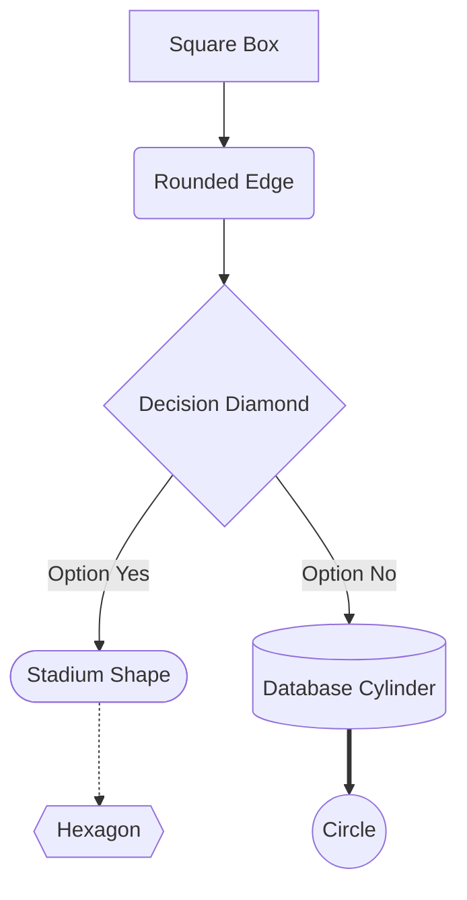
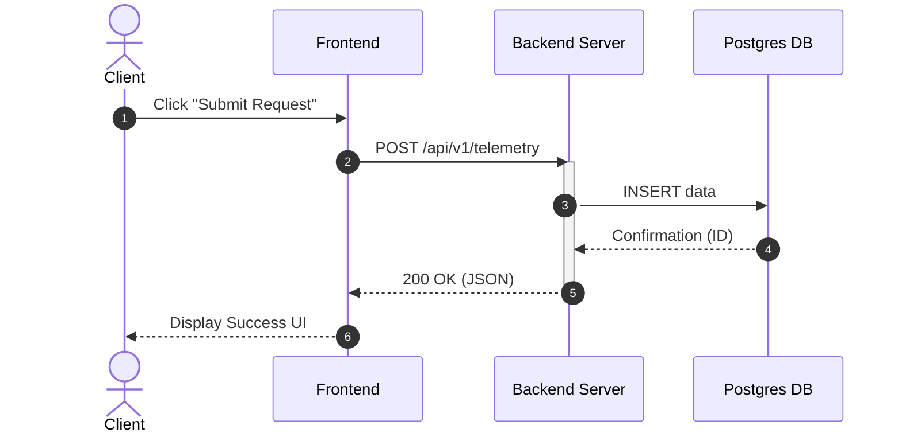
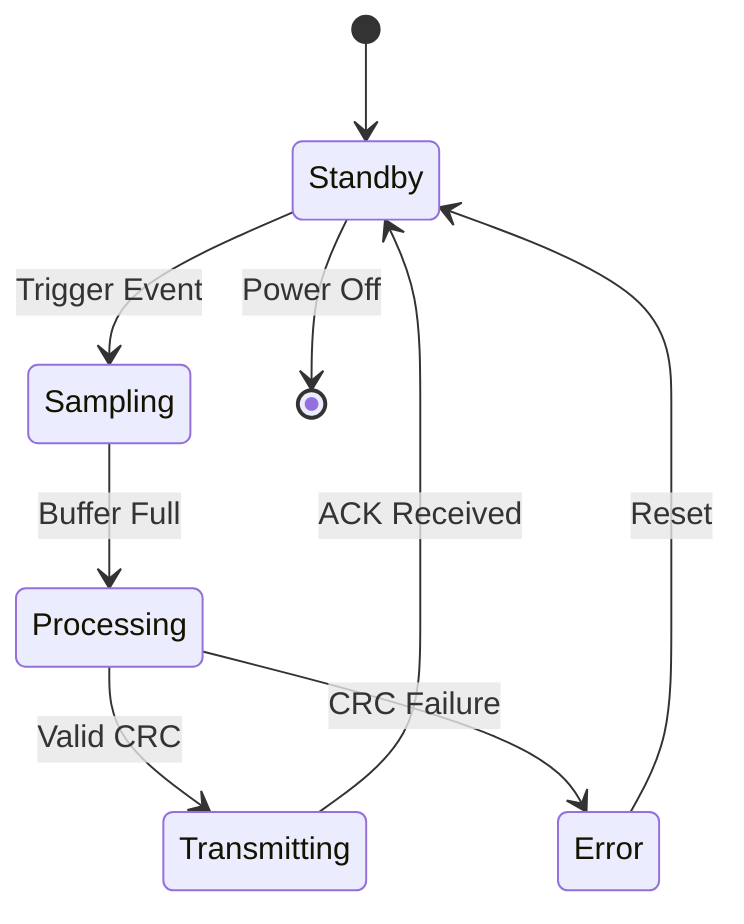
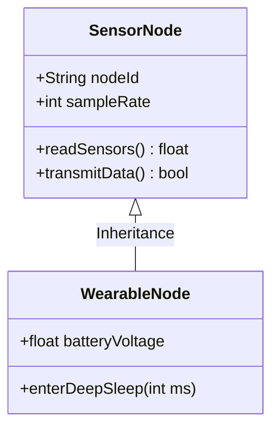
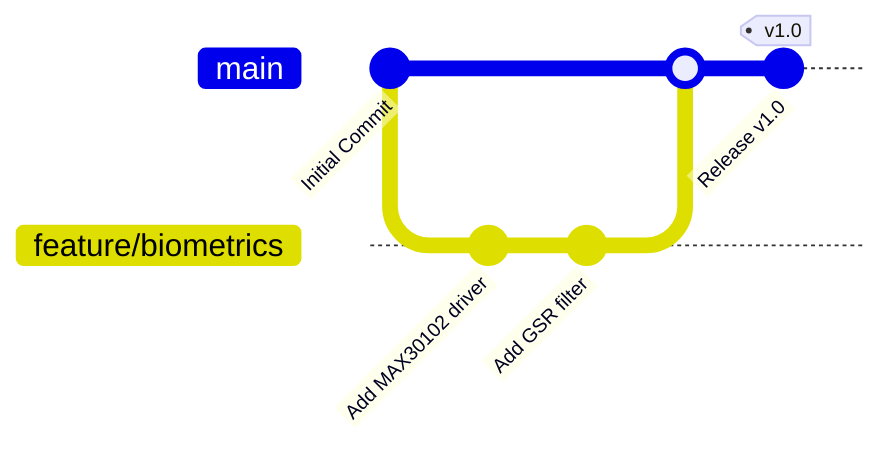
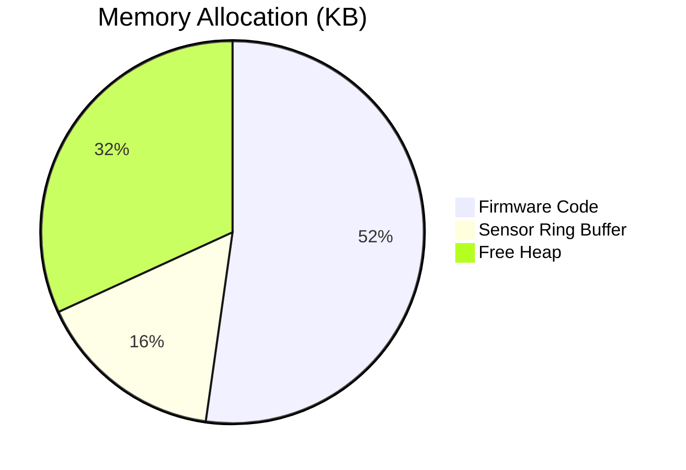

# Formatting Cheatsheet: Markdown, Mermaid & LaTeX

> **Quick Reference**: Press `q` or `<Esc>` to close this cheatsheet window.  
> In Neovim: `<leader>ch` or `<leader>?` opens this cheatsheet.  
> System-wide: `Super+Shift+C` (`Mod+Shift+C`) opens this floating window anywhere.

---

## 1. Markdown Essentials

### Text Styling

| Syntax | Output / Meaning |
|:---|:---|
| `**bold text**` or `__bold__` | **bold text** |
| `*italic text*` or `_italic_` | *italic text* |
| `***bold italic***` | ***bold italic*** |
| `~~strikethrough~~` | ~~strikethrough~~ |
| `` `inline code` `` | `inline code` |
| `==highlight==` | Highlighted text (supported in pandoc/render-markdown) |
| Line ending with `\` or two spaces `  ` | Hard line break (no empty line required) |

### Headings
```markdown
# Heading 1 (Document Title)
## Heading 2 (Major Section)
### Heading 3 (Subsection)
#### Heading 4 (Sub-subsection)
# Section Title {.unnumbered}       <-- Pandoc unnumbered heading (no "1.0")
```

### Lists & Task Lists
```markdown
* Unordered list item
  * Nested item (indented by 2 or 4 spaces)
  * Another nested item
1. Ordered list item 1
2. Ordered list item 2
- [ ] Incomplete task checklist
- [x] Completed task checklist
```

### Tables
```markdown
| Left-aligned | Center-aligned | Right-aligned | Default |
|:-------------|:--------------:|--------------:|---------|
| Item 1       |     Active     |        $10.50 | Data A  |
| Item 2       |    Pending     |         $5.25 | Data B  |
```

### Blockquotes & Callouts
```markdown
> Standard blockquote text.
>> Nested blockquote text.

> [!NOTE]
> Informational callout box.

> [!TIP]
> Helpful tip or shortcut.

> [!WARNING]
> Caution or alert note.
```

### Pandoc YAML Frontmatter & Page Breaks
```yaml
---
title: "Document Title"
subtitle: "Document Subtitle"
author: "Author Name"
date: "September 1, 2026"
abstract: |
  Brief summary of the report or document.
---
```
- **Page Break**: Insert `\pagebreak` or `\newpage` on an empty line.

---

## 2. Mermaid Diagram Reference

Place Mermaid syntax inside a code block marked with ```` ```mermaid ````:

### Flowchart / Graph
```markdown

```
*Directions*: `TD` (Top-to-Down), `LR` (Left-to-Right), `BT` (Bottom-to-Top), `RL` (Right-to-Left).  
*Link Types*: `-->` (solid arrow), `---` (solid line), `-.->` (dotted arrow), `==>` (thick arrow), `-->|label|` (labeled arrow).

### Sequence Diagram
```markdown

```

### State Diagram
```markdown

```

### Class Diagram
```markdown

```

### Git Graph
```markdown

```

### Pie Chart
```markdown

```

---

## 3. LaTeX Math Reference

Place LaTeX equations between single dollar signs for **inline** (`$E = mc^2$`) or double dollar signs for **display blocks** (`$$\int ...$$`):

### Arithmetic, Powers & Roots
| LaTeX Syntax | Mathematical Meaning / Display |
|:---|:---|
| `x^2`, `x_{i+1}` | Superscript $x^2$ and Subscript $x_{i+1}$ |
| `\frac{a + b}{c \cdot d}` | Fraction $\frac{a + b}{c \cdot d}$ |
| `\sqrt{x}`, `\sqrt[n]{x}` | Square root $\sqrt{x}$ and nth-root $\sqrt[n]{x}$ |
| `\pm`, `\mp` | Plus-minus $\pm$, Minus-plus $\mp$ |
| `\times`, `\div`, `\cdot` | Multiplication $\times$, Division $\div$, Dot $\cdot$ |

### Summations, Integrals & Limits
```latex
$$\sum_{i=1}^{n} x_i = x_1 + x_2 + \dots + x_n$$

$$\int_{a}^{b} f(x)\,dx = F(b) - F(a)$$

$$\lim_{x \to 0} \frac{\sin x}{x} = 1$$

$$\oint_C \mathbf{B} \cdot d\mathbf{l} = \mu_0 I_{\text{enc}}$$
```

### Greek Letters
- **Lowercase**: `\alpha` $\alpha$, `\beta` $\beta$, `\gamma` $\gamma$, `\delta` $\delta$, `\epsilon` $\epsilon$, `\theta` $\theta$, `\lambda` $\lambda$, `\mu` $\mu$, `\pi` $\pi$, `\sigma` $\sigma$, `\tau` $\tau$, `\omega` $\omega$
- **Uppercase**: `\Gamma` $\Gamma$, `\Delta` $\Delta$, `\Theta` $\Theta$, `\Lambda` $\Lambda$, `\Pi` $\Pi$, `\Sigma` $\Sigma$, `\Omega` $\Omega$

### Matrices & Vectors
```latex
$$\mathbf{A} = \begin{bmatrix}
a_{11} & a_{12} \\
a_{21} & a_{22}
\end{bmatrix}, \quad
\vec{v} = \begin{pmatrix} x \\ y \\ z \end{pmatrix}$$
```

### Piecewise Functions (Cases)
```latex
$$f(x) = \begin{cases} 
x^2 & \text{if } x \ge 0 \\ 
-x & \text{if } x < 0 
\end{cases}$$
```

### Multiline Equations with Alignment
```latex
$$\begin{aligned}
\nabla \cdot \mathbf{E} &= \frac{\rho}{\varepsilon_0} \\
\nabla \cdot \mathbf{B} &= 0 \\
\nabla \times \mathbf{E} &= -\frac{\partial \mathbf{B}}{\partial t} \\
\nabla \times \mathbf{B} &= \mu_0 \mathbf{J} + \mu_0 \varepsilon_0 \frac{\partial \mathbf{E}}{\partial t}
\end{aligned}$$
```

---

## 4. Document Export Shortcuts

| Keybinding | Output Format | Engine / Technology |
|:---|:---|:---|
| `<leader>op` | **PDF** | Pandoc + Typst engine (renders Mermaid SVG & LaTeX) |
| `<leader>od` | **DOCX** | Pandoc native Word OMML equations & embedded diagrams |
| Terminal CLI | PDF or DOCX | `md-export input.md [pdf\|docx] [output]` |
